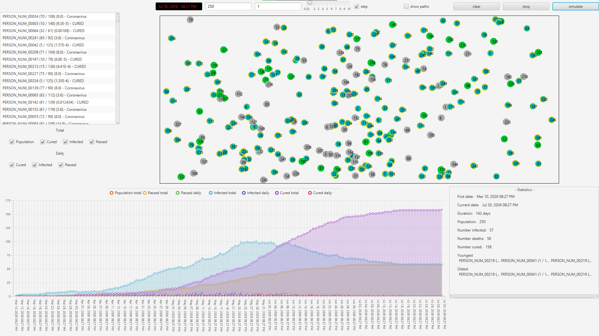

# COVID19_Interaction_Simulator
COVID-19 interaction simulator built with JavaFX modeling contagion spread in configurable populations.

- Program demonstrates a population of dots moving about a rectangle, spreading a contagious virus.
- Change the population size, initial infected, and simulation speed to watch how the virus traverses a population.
- Investigate an individual's history with the virus to tell if they were able to avoid infection, or if they contracted and spread it.
- View how the population's infected and cured populations fluctuate day-by-day and throughout the simulation.

Program written using JavaFX